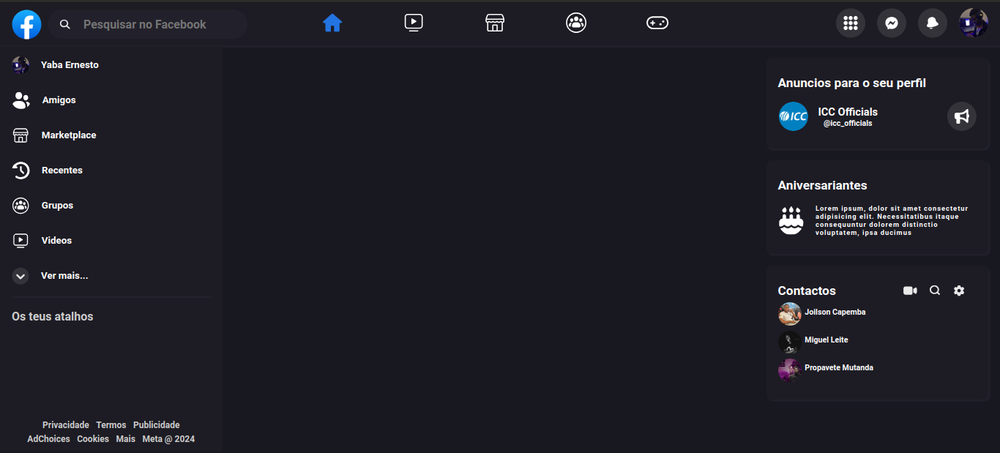

# Facebook Web Clone

A fins de consolidar os estudos de ReactJS + TypeScript, resolvi desenvolver a UI do Facebook Web.

#### Tecnologias
- ReactJS
- TypeScript
- CSS
- CSS Module

#### projeto


#### Para testar

```bash
git clone https://github.com/yabaernesto/facebookWebClone
```

```bash
npm install
```

```bash
npm run dev
```

<h3>Para mudar a porta em que está rodando o projeto, vá até o arquivo <strong style="color: purple;">vite.config.ts</strong> e mude o numero da port: </h3>

```js
import { defineConfig } from 'vite'
import react from '@vitejs/plugin-react'

// https://vitejs.dev/config/
export default defineConfig({
  plugins: [react()],
  server: {
    port: 3001,
  },
})
```
